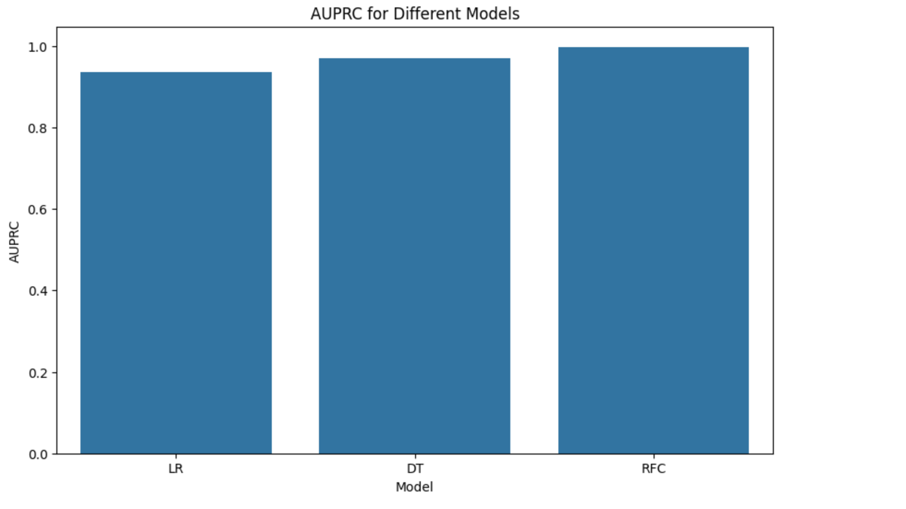

# 信用卡交易欺诈检测分析报告

 **团队名称**：诗酒趁年华

**问题陈述**：2021 年，与信用卡欺诈相关的损失超过 120 亿美元，同比增长近 11%。就重大财务损失、信任和信誉而言，这是银行、客户和商户面临的一个令人担忧的问题。电子商务相关欺诈一直在以约 13% 的复合年增长率 (CAGR) 增加。由于欺诈性信用卡交易急剧增加，在交易时检测欺诈行为对于帮助消费者和银行非常重要。机器学习可以通过训练信用卡交易模型，然后使用这些模型更快、更准确地检测欺诈交易，在预测欺诈方面发挥至关重要的作用。

 **项目简介**：项目数据集包含欧洲持卡人于 2013 年 9 月通过信用卡进行的交易信息，此数据集显示的是两天内发生的交易。在 284807 笔交易中，存在 492 起欺诈，数据集高度不平衡，正类（欺诈）仅占所有交易的 0.172%，原数据集已做下采样和SMOTE处理。匿名变量V1， V2， ...V28 是 PCA 获得的主成分，唯一未经过 PCA 处理的变量是 Time 和 Amount，需要对其进行归一化处理。在该项目中本团队根据现有数据集分别建立了逻辑回归、决策树和随机森林模型进行训练，结合使用英特尔 oneAPI AI分析工具包对信用卡欺诈行为进行检测。

注：PCA - "Principal Component Analysis" - 主成分分析，用于提取数据集的"主成分"特征，即对数据集进行降维处理。

**构建项目时采用的技术栈**：

构建项目是采用的技术栈为python，同时结合使用了英特尔 oneAPI分析工具中的sklearn加速库，见下图：

**主要实现方案**：

分别建立了逻辑回归、决策树和随机森林模型，结合使用英特尔 oneAPI分析工具中的sklearn加速库通过网格化搜索的方法训练出三种模型的最优参数（见下图），最后通过可视化的方式比较出最优训练模型。

（逻辑回归模型）

（决策树模型）

（随机森林模型）

**项目分析结果**：

经比较三种模型（LR：逻辑回归模型、DT：决策树模型、RFC：随机森林模型）的F1和AUPRC，随机森林模型的训练效果最佳，其F1值为99.86%，AUPRC为99.79%。

（三种模型的测试结果）

（三种模型的F1比较）

（三种模型的AUPRC比较）

**团队收获**：在该项目中，我们使用了英特尔 oneAPI分析工具中的sklearn加速库，通过与常规训练测试结果进行比较，oneAPI的使用大大缩短了整体模型的训练时间，这激发了我们对于oneAPI工作原理的好奇心。结合课程讲解和查阅资料，我们了解到oneAPI的机器学习加速原理主要基于并行计算、硬件加速器的使用、性能优化、库的支持等，这拓展了我们的认知视野，在后续的机器学习中，我们也会继续尝试结合使用oneAPI，希望能够进一步认识了解oneAPI！

